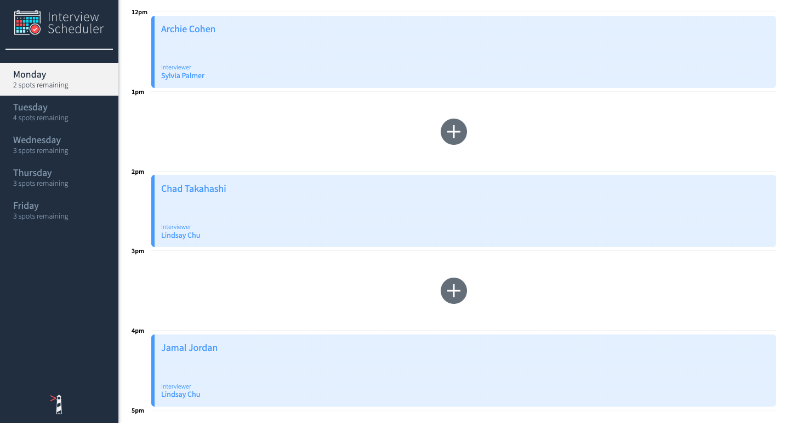
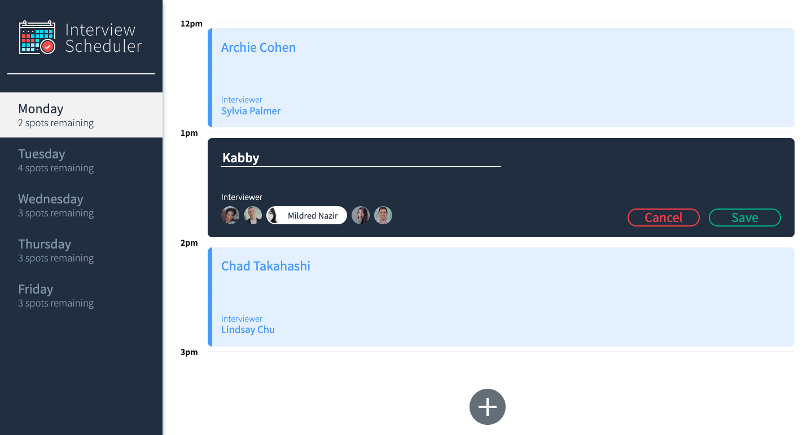
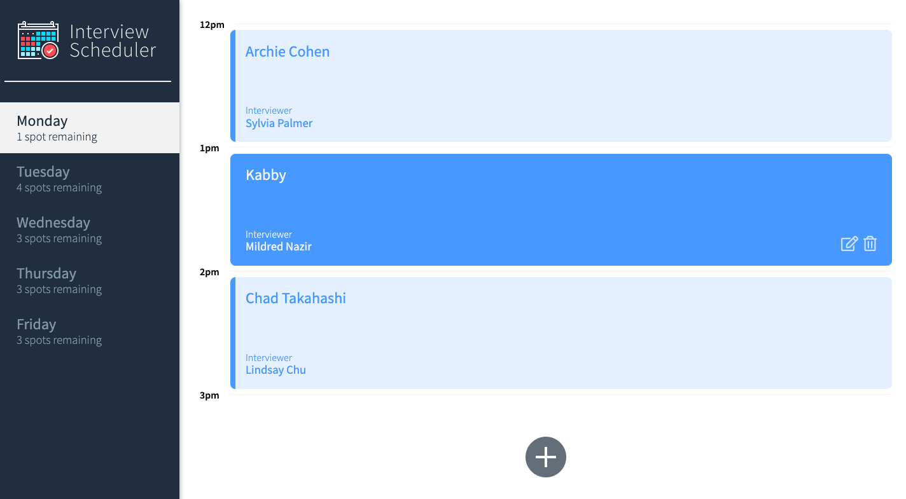
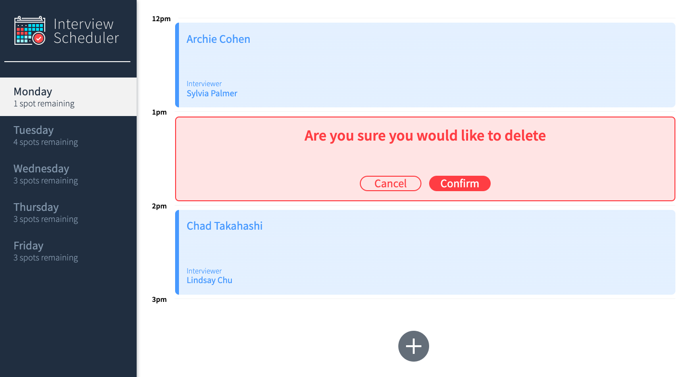

# Interview Scheduler

## Tech Stack

Front-End: React, JavaScript, Axios, JSX, HTML, SASS, Webpack

Back-End: Express, Node.js, PostgreSQL

Testing: Storybook Jest, Cypress

## Final product

### Main view


### Adding a new appointment


### New appointment added


### Confirmation step before deleting an appointment



## Setup

Install dependencies with `npm install`.

## Running Webpack Development Server

```sh
npm start
```

## Running Jest Test Framework

```sh
npm test
```

## Running Storybook Visual Testbed

```sh
npm run storybook
```
